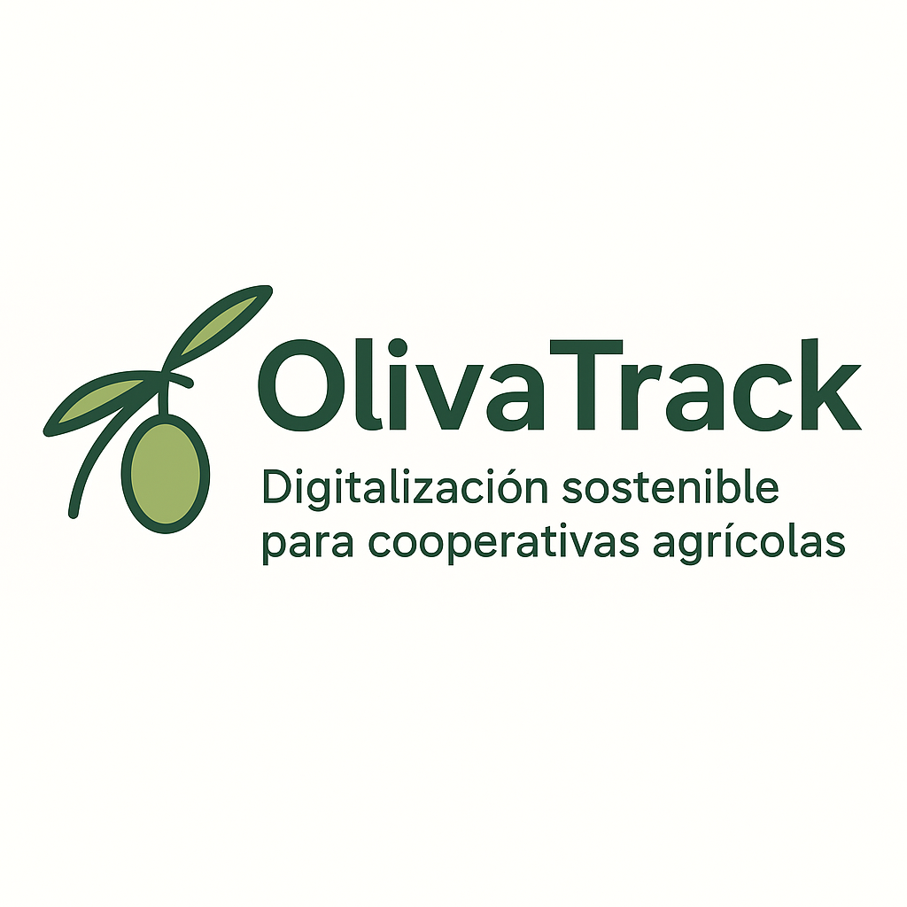

# OlivaTrack 
**Software de gestión agrícola especializado en la trazabilidad del olivar.**

OlivaTrack permite registrar parcelas, tratamientos, control de cosechas, seguimiento de producción y análisis de rendimiento, todo desde una interfaz sencilla y adaptada a pequeñas y medianas explotaciones.

---

## Licencia

Este proyecto se distribuye bajo la **AGPL-3.0 License**.

He elegido esta licencia porque garantiza que cualquier mejora o modificación del software que se haga pública a través de un servicio en red también debe quedar disponible para la comunidad. Esto mantiene el espíritu abierto del proyecto y evita la apropiación privativa.

---

## Modelo de negocio

Aunque el software es libre, ofrezco servicios adicionales:

| Servicio | Descripción | Forma de ingreso |
|---------|-------------|----------------|
| Instalación y despliegue | Configuración en local o nube | Pago único |
| Hosting y mantenimiento | Monitorización, copias, actualizaciones | Suscripción mensual |
| Personalización | Adaptaciones a cada finca o cooperativa | Presupuesto por horas |
| Formación | Capacitación para trabajadores y gestores | Sesiones formativas |

Esto permite sostener el proyecto económicamente sin cerrar el código.

---

## Características principales
- Gestión de parcelas y propietarios
- Registro de tratamientos y operaciones de campo
- Seguimiento de recolección y rendimiento
- Informes exportables en PDF/Excel
- Preparado para cooperativas y productores independientes

---

## Logotipo

---

## 🟢 Estado del proyecto
Versión inicial. En desarrollo.
